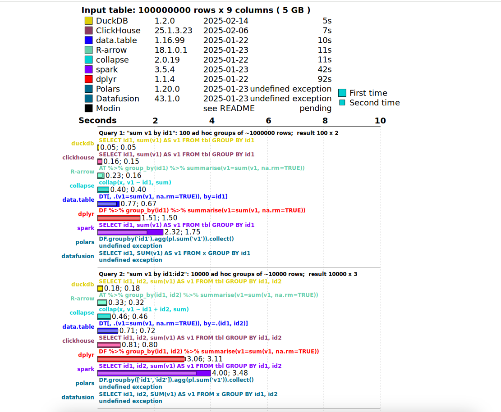

## Existing evaluations
1. [Benchmarking Ourselves over Time at DuckDB](https://duckdb.org/2024/06/26/benchmarks-over-time.html#appendix)
2. [DuckDB vs SQLite: Performance, Scalability and Features](https://motherduck.com/learn-more/duckdb-vs-sqlite-databases/)
3. [Database-like ops benchmark](https://duckdblabs.github.io/db-benchmark/)



## Updated Evaluations Ideas
DuckDB has been extensively tested by its community. The most authoritative existing evaluations are listed above. These works mainly focus on comparing query performance across different databases, DuckDB versions, or system resource overheads. However, one common drawback of these evaluations is that they tend to be too general and lack specialization. For instance, many of their benchmark queries are synthetic or doctrinal, and offer limited semantic meaning. Given that DuckDB is increasingly used in edge computing scenarios, we propose a real-world edge analytics setting based on the NYC Yellow Taxi dataset. Specifically, **the scenario could be on-device analytics within a smart taxi system, where DuckDB is embedded into the vehicles‘ edge unit to process trip data in real time**. **The goal is to evaluate whether DuckDB can handle typical analytical tasks — such as location-based aggregations, payment-type breakdowns, or route-level filtering — efficiently and reliably under such realistic constraints.** We aim to assess **whether DuckDB can truly excel in these daily, high-frequency, resource-constrained query workloads.**

We are planning to: (✅ indicateds completed)

#### 1. Simulate the edge computing environment using Docker. ✅ 

CPU Model, CPU Frequency, CPU Core #, Memory Size, Disk SIze,


#### 2. Insert the **entire 2023 NYC Yellow Taxi dataset** (~10M rows) into DuckDB under the constrained environment. ✅

* Measure:
  - **Ingestion rate (rows/sec)**
  - **CPU / Memory usage**
  - **Disk I/O (optional)**
* Plot performance metrics as time-series charts.
* Identify periodic ingestion slowdowns or throughput fluctuations and correlate them with memory pressure, GC behavior, or internal DuckDB buffering strategy by looking into source code


#### 3. Design and implement a **random query generator** ✅ 

* Build a query workload generator tailored to the **schema and semantics** of the taxi dataset.
  * Each query type represents **a common real-world business scenario** in urban mobility platforms.
    * Query types include:
      * `groupby[payment_type]` – e.g., "Count of payment types"
      * `top_k[pulocationid]` – e.g., "Top __ pickup locations"
      * `filter_range[trip_distance, total_amount]` – e.g., "Long and expensive trips"
      * `random_month_window[pickup_datetime]` – e.g., "Trips from a random month"
      * If needed, we can analyze and add more types.
      
      

#### 4. Continuous streaming queries under limited resources(Await running) ✅

> Since we've previously inserted the entire table into duckdb. We can persistent the entire in-memory database into a local `*.duckdb` file. Then next time we can simply connect the database, and query the **specific table**. (Question: Do we need to seperate the table into multiple partitions e.g. table1, table2... and test DuckDB's performance of randomly querying the multiple tables? Or storing all data in one table and testing single table querying performance would be enough?
>
> We perfer to choose to keep the data in a **single large table** for the following reasons:
>
> - Most real-world edge analytics systems prioritize **schema simplicity and local joins**
> - DuckDB internally supports **efficient indexing and columnar access**, which already optimizes large-table queries
> - We aim to evaluate DuckDB's performance in a realistic setup that mirrors embedded analytics **without manual sharding**

* Simulate a **non-stop background querying workload**:
  - **Query frequency**: 0.5 to 1.0 seconds (configurable delay).
  - **Duration**: Up to 1 hour of continuous querying.
  - **Metrics collected** per query:
  
    - Query latency
    - Result row count
    - CPU usage
    - Memory usage
  
    All metrics are logged in `.jsonl` format for later visualization and analysis.
* Run it for **up to 1 hour continuously** under the constrained hardware configuration.


#### 5. Continously streaming writings(Await running) ✅

To simulate a real-world edge data ingestion scenario — such as a taxi dispatch system, a vehicle-side trip recorder, or an IoT-based traffic monitor — we emulate **continuous writing** into DuckDB with randomly sampled records from the existing dataset. 

Instead of generating synthetic data from scratch, we **reuse real records** already present in the NYC Yellow Taxi dataset. This ensures that:

- All incoming records have valid schema, value distributions, and domain semantics
- The write performance reflects realistic data characteristics (e.g., timestamps, location IDs, outliers)

 The ingestion process is designed to mimic a **streaming sensor or event system**, where:

- Each insertion batch consists of **1–100 random rows**, sampled with replacement
- Insertion intervals are randomized between **0.1 to 1.0 seconds**
- Writes are appended continuously to the same table (`yellow_taxi_streaming`), simulating real-time accumulation
- Each write operation is logged, including:
  - Rows inserted
  - Write latency
  - CPU / memory usage post-insertion

 This helps us answer:

- Can DuckDB sustain frequent edge-level writes without significant memory bloat?
- Does ingestion speed degrade over time under memory pressure?
- How sensitive is write performance to batch size and interval jitter?


#### 6. Hybrid workload: continuous querying and writing (Await Running)


#### 7. **Set up SQLite** (def needed) **and Redis** (if possible). Repeat the above procedures and run the same test workflows on both systems to compare their performance with that of DuckDB.


### 8. Extras

Possibility of concurrent querying and writing on duckdb?


## 1. Build the Docker Image

```bash
docker build -t duckdb-ingest .
```

## 2. Run the Container with Resource Limits (4GB of memory and 2 CPU cores)
```bash
docker run --rm -it \
  --memory=4g --memory-swap=4g \
  --cpus=2 \
  -v "$PWD":/test \
  duckdb-ingest
```
## 3. Run ingestion_test.py
```bash
python ingestion_test.py
```

## 4. ingestion_plot.py
```bash
python ingestion_plot.py
```

### 1. Stream Writing
```bash
cd /test
```
```bash
#单表，随机行数插入，有波动。
python -m src.duckdb.ingestion_test_streamwrite \
  --csv /test/data_set/2023_Yellow_Taxi_Trip_Data.csv \
  --db /test/db/duckdb/streamwrite_random.duckdb \
  --table yellow_taxi_test_streamwrite \
  --log /test/log/duckdb/6/streamwrite_10min_random.jsonl \
  --max-seconds 600 \
  --delay-min 0.1 \
  --delay-max 1.0

# 生成图表
python -m src.duckdb.ingestion_plot_streamwrite \
  --log /test/log/duckdb/6/streamwrite_10min_random.jsonl \
  --out /test/plots/duckdb/6/streamwrite_10min_random.png \
  --title "StreamWrite Ingestion - 1 Hour Test"
```

```bash
# 每个batch固定行数写入，写入间隔1秒
python -m src.duckdb.ingestion_test_streamwrite \
  --csv /test/data_set/2023_Yellow_Taxi_Trip_Data.csv \
  --db /test/db/duckdb/streamwrite_fixed.duckdb \
  --table yellow_taxi_test_streamwrite \
  --log /test/log/duckdb/3/streamwrite_1h_fixed.jsonl \
  --max-seconds 3600 \
  --mode fixed_rows
```

```
# 生成图表
python /test/src/duckdb/ingestion_plot_streamwrite.py \
  --log /test/log/duckdb/6/streamwrite_1h_fixed.jsonl \
  --out /test/plots/duckdb/6/streamwrite_1h_fixed.png \
  --title "DuckDB StreamWrite Ingestion - 1 Hour Test"
```

```

### 2. Querying DuckDB
python -m src.duckdb.query_test \
  --db /test/db/taxi_data.duckdb \
  --table yellow_taxi_trips \
  --sample /test/data_set/2023_Yellow_Taxi_Trip_Data.csv \
  --log /test/log/duckdb/6/query_1h.jsonl \
  --max-seconds 600

```bash
python -m src.duckdb.query_plot \
  --log /test/log/duckdb/5/query_1h.jsonl \
  --out /test/plots/duckdb/5/query_1h.png \
  --title "DuckDB Query Performance - 1 Hour Testing" \
  --width 15 \
  --height 8
```

## 3. query 和 write 同时执行。
duckdb不能同时读取相同的数据库文件。所以必须对被测数据库做一个readonly备份。

```
./scripts/mixed_test.sh

python /test/src/query_plot.py \
  --log /test/log/test_runs/mixed_test_1h_log_query.jsonl \
  --out /test/plots/mixed_test_query_1h_metrics.png \
  --title "DuckDB Query Performance - 1 Hour Testing" \
  --width 15 \
  --height 8
```


## 4. sqlite3 跑相同的测试
https://github.com/duckdb/duckdb/discussions/13371
```bash 
# 1小时，每个batch 0.1 - 1 秒延迟， 每个batch固定插入10行
python -m src.sqlite.ingestion_test_streamwrite \
  --csv /test/data_set/2023_Yellow_Taxi_Trip_Data.csv \
  --db /test/db/sqlite/1/test_streamwrite.sqlite3 \
  --table yellow_taxi_test_streamwrite \
  --log /test/log/sqlite/1/streamwrite_1h_fixed.jsonl \
  --max-seconds 3600 \
  --delay-min 0.1 \
  --delay-max 1.0
  --mode fixed_rows
  
# 统计 y轴插入行数 x轴时间
python -m src.sqlite.ingestion_plot_streamwrite \
  --log /test/log/sqlite/1/streamwrite_1h_fixed.jsonl \
  --out /test/plots/sqlite/1/streamwrite_1h_fixed.png \
  --title "SQL StreamWrite Ingestion - 1 Hour Test"
```

```bash
python -m src.sqlite.query_test \
  --db /test/db/taxi_data.sqlite \
  --table yellow_taxi_trips \
  --sample /test/data_set/2023_Yellow_Taxi_Trip_Data.csv \
  --log /test/log/sqlite/5/query_1h.jsonl \
  --max-seconds 3600

```bash
python -m src.duckdb.query_plot \
  --log /test/log/duckdb/5/query_1h.jsonl \
  --out /test/plots/duckdb/5/query_1h.png \
  --title "DuckDB Query Performance - 1 Hour Testing" \
  --width 15 \
  --height 8
```


## 5. RocksDB

```
# 1. 固定行数
export LD_LIBRARY_PATH=/usr/lib/x86_64-linux-gnu:$LD_LIBRARY_PATH
/test/src/rocksdb/build/ingestion_test_streamwrite \
  --csv /test/data_set/2023_Yellow_Taxi_Trip_Data.csv \
  --db /test/db/rocksdb/5/test_streamwrite.db \
  --log /test/log/rocksdb/5/streamwrite_1h_fixed.jsonl \
  --max-seconds 600 \
  --delay-min 0.1 \
  --delay-max 1.0 \
  --mode fixed_rows
```
```
python -m src.duckdb.ingestion_plot_streamwrite \
  --log /test/log/rocksdb/6/streamwrite_1h_random.jsonl \
  --out /test/plots/rocksdb/6/streamwrite_1h_random.png \
  --title "RocksDB StreamWrite Ingestion - 1 Hour Test"
```

```bash
# 2. 随机行数
/test/src/rocksdb/build/ingestion_test_streamwrite \
  --csv /test/data_set/2023_Yellow_Taxi_Trip_Data.csv \
  --db /test/db/rocksdb/6/test_streamwrite.db \
  --log /test/log/rocksdb/6/streamwrite_1h_random.jsonl \
  --max-seconds 600 \
  --delay-min 0.1 \
  --delay-max 1.0 \
```
```
# 生成图表
python /test/src/duckdb/ingestion_plot_streamwrite.py \
  --log /test/log/rocksdb/6/streamwrite_1h_fixed.jsonl \
  --out /test/plots/rocksdb/6/streamwrite_1h_fixed.png \
  --title "RocksDB StreamWrite Ingestion - 1 Hour Test"
```


```
# 3. query test
/test/src/rocksdb/build/query_test \
  --csv /test/data_set/2023_Yellow_Taxi_Trip_Data.csv \
  --db /test/db/rocksdb/taxi_data_rocksdb \
  --log /test/log/rocksdb/5/query_1h.jsonl \
  --max-seconds 600
```
```bash
python -m src.rocksdb.query_plot \
  --log /test/log/rocksdb/5/query_1h.jsonl \
  --out /test/plots/rocksdb/5/query_1h.png \
  --title "RocksDB Query Performance - 1 Hour Testing" \
  --width 15 \
  --height 8 \
```


### **3. 测试方法**

#### **3.1 流式输入**

日志格式：

* Query：
* Ingest:

##### **3.1.1 随机读取**

- 数据： 2023 NYC Taxi Data.csv
- 读取一个小时
- 每个批次时间： 0.1 - 1秒，随机
- 每个批次数据量： 从csv中读取随机1 ～ 100行数据。csv中起始index随机
- 每个批次数据插入到 streamwrite_random.duckdb 中的 yellow_taxi_test_streamwrite_表

##### **3.1.2 固定读取**

- 数据： 2023 NYC Taxi Data.csv
- 读取一个小时
- 每个批次时间： 1秒
- 每个批次数据量： 从csv中读取10行数据。csv中起始index随机
- 每个批次数据插入到 streamwrite_fixed.duckdb 中的 yellow_taxi_test_streamwrite表

对于每种插入数据，统计：

x: 长度为1小时的时间轴

y：

- 插入速度：插入的行数/插入耗时 
- CPU %
- Memory%
- Disk Read
- Disk Write

#### **3.2 查询全表（单表）。**

先前已经把csv中的所有行，插入到数据库中。

根据实际业务场景。从csv中选择columns, 生成符合业务场景的sql。以下所有类型各对应一条sql。并且对这些类型，根据workload和可能返回数据的行数分为两类：normal_query和 heavy_query.

其中

**Normal Query包括**：

**Heavy Query包括：**。

对于Heavy Query中，一定会返回全表数据的查询有：

对于这些一定会返回全表的查询。我们额外添加一个Limit查询，看下分页后的结果

----

执行的方法：

* 数据：整个2023 NYC Taxi Data 数据库
* 每个批次时间：取决于查询速度
* 每个批次数据量（影响行数）：取决于查询语句
* 每个批次查询语句：
  * 一共10个。9个来自normal query（低wordload），1个来自heavy load。都随机抽取
  * 

https://tangdh.life/posts/database/duckdb-file/

https://tangdh.life/posts/database/duckdb-file/


```


##

# 📘 DuckDB Ingestion Benchmark with Resource Monitoring

This project provides a Docker-based environment to test the **ingestion performance** of DuckDB under resource constraints. It inserts data in batches and logs **CPU usage**, **memory (RSS)**, and **insertion time** for each batch to a CSV file.

---

## ✅ Goals

- 分析 ingestion rate drop 的原因

- 测试 DuckDB 的极限（系统崩不崩、何时崩）

---
## 1. Build the Docker Image

```bash
docker build -t duckdb-ingest .
```

## 2. Run the Container with Resource Limits (4GB of memory and 2 CPU cores)
```bash
docker run --rm -it \
  --memory=4g --memory-swap=4g \
  --cpus=2 \
  -v "$PWD":/test \
  duckdb-ingest
```

## 3. Run test1.py
```bash
python test1.py
```

## 4. plot
```bash
python plot.py
```


